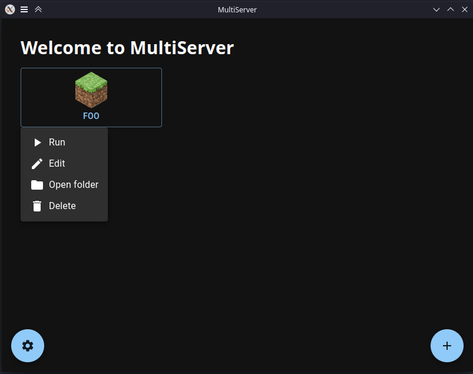

# MultiServer

> The most pragmatic and efficient way to orchestrate multiple Minecraft servers.

MultiServer is an app that allows for easy management of minecraft servers.
Each server can be of different versions and/or different modding/plugin platforms.

## Installation

Currently, there are no prebuilt binaries/installers for MultiServer, as it is not yet fully complete (and I cannot pay for the required signing certificates).
You can easily build the app following [these instructions](BUILDING.md).

## Usage

When you open the app, you will see the main window, where you will see all of your server profiles (if any).
To create a new server, click on the + button at the bottom-right of the window:

To run a server, click on its name and then click the run button as shown below:

A new window will open showing the server log, a command line to execute commands on the server, and a sidebar on the left displaying player info.

There is also a settings window where you can edit the app color theme, the default java executable path (color theme not implemented yet).
Specific settings on each server instance will override global settings.

> More detailed information will be added in the wiki section of the repository.

Currently the only way to add mods, plugins, or datapacks to a server is to open its directory (available as an option near the run button), though this may change in the future with popular demand.

## Contributing

If you would like to see a new feature added or a bug fixed, feel free to create an issue or a pull request.
Please direct pull requests to the [main](https://github.com/dheerajpv/multiserver/tree/main) branch.
You can also join the MultiServer Discord server [here](https://discord.gg/CvEwcynFfe).
Please make sure to follow the [code of conduct](CODE_OF_CONDUCT.md).

## Legal

### License

Multiserver is licensed under version 3 of the [GNU General Public License](LICENSE), or at your option, any later version.

### Mojang

By creating any minecraft servers (using MultiServer or not), you agree to follow the [relevant terms](https://www.minecraft.net/en-us/terms)

MultiServer is in no way affiliated with or endorsed by Mojang AB, the Minecraft name, or Microsoft Corporation.
