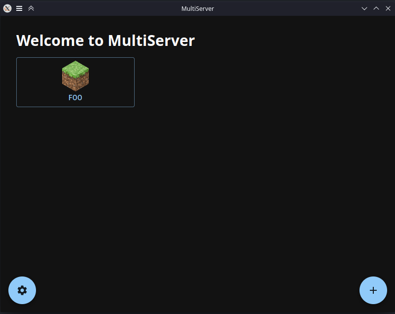

# MultiServer

> The most pragmatic and efficient way to orchestrate multiple Minecraft servers.

MultiServer is an app that allows for easy management of Minecraft servers.
Each server can be of different versions and/or different modding/plugin platforms.

## Installation

The releeases page provides pre-built installers for Windows (on x64), macOS (both intel-based and Apple Silicon), and a generic Linux archive.
If you would like installers built for your platform, do send a pull request with the relevant CI job (see [Contributing](#Contributing)).

## Usage

When you open the app, you will see the main window, where you will see all of your server profiles (if any).
To create a new server, click on the + button at the bottom-right of the window:

To run a server, click on its name and then click the run button as shown below:

A new window will open showing the server log, a command line to execute commands on the server, and a sidebar on the left displaying player info.

There is also a settings window where you can edit the app settings, such as:

-   Color theme (defaults to OS-detected)
-   Default Java executable path (defaults to `java` in PATH)
-   Default JVM arguments (defaults to none, useful for increasing the max heap size with the `-Xmx` flag)
-   Directory to save all server instances in (no instance-specific override for this one)

Specific settings on each server instance will override global settings.

There is also limited support for a mods window on fabric servers where you can drag and delete mods.
Opening the folder is probably still more featureful at the moment, but if there is demand a better mods window is not off the table.

## Contributing

If you would like to see a new feature added or a bug fixed, feel free to create an issue or a pull request.
Please direct pull requests to the [main](https://github.com/dheerajpv/multiserver/tree/main) branch.
You can also join the MultiServer Discord server [here](https://discord.gg/CvEwcynFfe).
Please make sure to follow the [code of conduct](CODE_OF_CONDUCT.md).

## Legal

### License

Multiserver is licensed under version 3 of the [GNU General Public License](LICENSE), or at your option, any later version.

### Mojang

By creating any Minecraft servers and using any other Minecraft content (using MultiServer or not), you agree to follow the [Minecraft EULA](https://www.minecraft.net/en-us/eula).

MultiServer is in no way affiliated with or endorsed by Mojang Synergies AB, the Minecraft name, or Microsoft Corporation.
